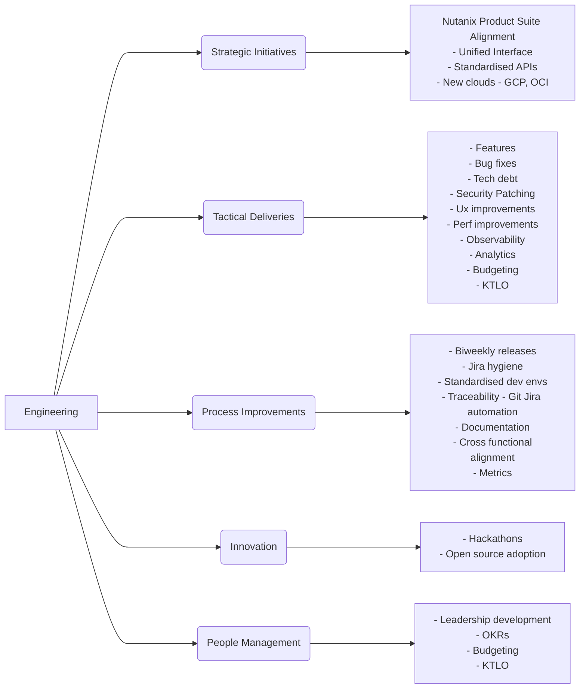

## Welcome to Sharad's page 👋

Here's an overview of my experience.
### Nutanix, Engineering Director (2017+)

### Sandvine, Architect (2016-2017)
### Sandvine, Engineering Manager (2012-2015)
### Bluecoat, Sr. Staff (2011-2012)
### Cisco, Sr. Engineer (2006-2011)
### Flextronics, Sr. Engineer (2005-2006)
### Ixia, Engineer (2005-2005)
### Lumenare, Engineer (2003-2005)

